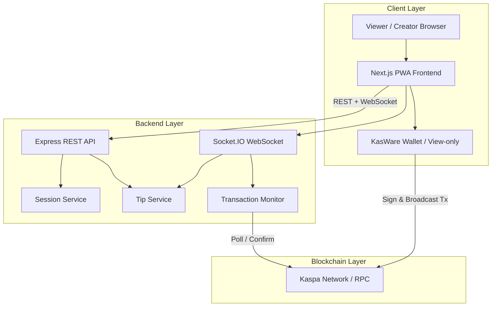
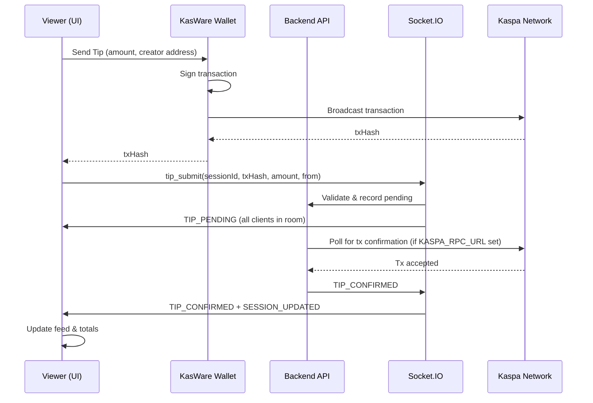
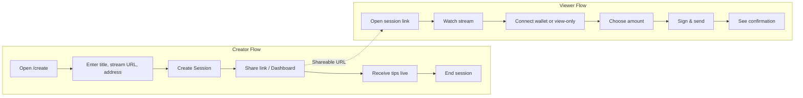

<p align="center">
  
</p>

# 🎸 KaspaConcert

**Real-Time Live-Stream Tipping on the Kaspa Blockchain**

[](LICENSE)
[](https://nodejs.org/)
[](https://nextjs.org/)
[](https://kaspa.org/)

---

## 📑 Table of Contents

- [Overview](#-overview)
- [Main Goal & Importance](#-main-goal--importance)
- [Problem Statement](#-problem-statement)
- [Solution & Why It's Necessary](#-solution--why-its-necessary)
- [Sustainability](#-sustainability)
- [Key Features](#-key-features)
- [Architecture](#-architecture)
- [Tech Stack](#-tech-stack)
- [Project Structure](#-project-structure)
- [Prerequisites](#-prerequisites)
- [Installation](#-installation)
- [Configuration](#-configuration)
- [Running the Application](#-running-the-application)
- [Demo Mode & Testing](#-demo-mode--testing)
- [API Reference](#-api-reference)
- [WebSocket Events](#-websocket-events)
- [Security](#-security)
- [Documentation](#-documentation)
- [Contributing](#-contributing)
- [License](#-license)
- [Acknowledgments](#-acknowledgments)

---

## 🎯 Overview

**KaspaConcert** is a decentralized live-streaming tipping platform where creators receive **instant**, **low-fee** tips in **$KAS** directly from their audience. Built for the **Kaspathon** and the broader Kaspa ecosystem, it leverages Kaspa's **BlockDAG** architecture and sub-second block times to deliver a tipping experience that feels as immediate as a "Like" button—but with **real value** and **real ownership**.

Every tip is a **real on-chain Kaspa transaction**. There are no custodians, no delayed payouts, and no opaque platform fees. Funds move directly from viewer wallet to creator wallet, with real-time confirmation feedback in the UI.

---

## 🎯 Main Goal & Importance

| Aspect | Description |
|--------|-------------|
| **Primary Goal** | Enable **instant**, **on-chain** micro-payments to creators during live events using the Kaspa blockchain, proving that real-time consumer blockchain applications are practical today. |
| **Strategic Importance** | KaspaConcert serves as a **flagship use case** for Kaspa's speed advantage: live, interactive value transfer that was previously impractical on slower chains. |
| **Ecosystem Value** | Open-source reference implementation for real-time payments; inspires builders and demonstrates Kaspa integration patterns (RPC, wallet, WebSocket-driven UI). |
| **User Impact** | Creators get **immediate access** to earnings; fans get **instant feedback** when tipping—both without platform friction or intermediary control. |

---

## ❌ Problem Statement

Live-stream monetization today suffers from systemic issues that hurt creators and fans alike:

| Problem | Impact |
|---------|--------|
| **Delayed payouts** | Creators wait days or weeks for platform payouts; cash flow and motivation suffer. |
| **Opaque & platform-controlled** | Revenue share and fees are unclear; platforms act as gatekeepers. |
| **Off-chain payments** | Most tips are processed off-chain; no direct ownership or transparency. |
| **High fees** | Platform and payment processor fees reduce creator earnings significantly. |
| **Blockchain UX failures** | Slow confirmations break immersion; high fees discourage micro-tipping; crypto is perceived as complex. |
| **No standard for real-time on-chain tipping** | There is no widely adopted system for **real-time**, **on-chain** tipping during live content. |

KaspaConcert addresses these by combining **live streaming** (existing platforms or embedded streams), **instant Kaspa transactions**, a **responsive PWA**, and **real-time on-chain feedback**—so every tip is real, confirmed in seconds, and reflected in the UI immediately.

---

## ✅ Solution & Why It's Necessary

KaspaConcert solves the above by:

1. **Direct, instant value transfer** — KAS goes from viewer wallet to creator wallet; no intermediary holds funds.
2. **Sub-second confirmation feedback** — Kaspa's BlockDAG and fast block times (<1s) make confirmation feel real-time.
3. **Real-time UI** — WebSockets push `TIP_PENDING` and `TIP_CONFIRMED` events so the feed and totals update without refresh.
4. **Non-custodial design** — All signing is client-side (e.g. KasWare Wallet); the backend never touches private keys.
5. **Transparent & verifiable** — Every tip is an on-chain transaction; creators and fans can verify on explorers.

**Why it's necessary:** The creator economy needs a **trust-minimized**, **instant-settlement** option. KaspaConcert proves that with the right infrastructure (Kaspa), live blockchain payments are not only possible but **delightful**—reducing friction and enabling new engagement mechanics (tip-based interactions, instant gratification).

---

## 🌱 Sustainability

| Dimension | Approach |
|-----------|----------|
| **Technical** | Stateless backend, file-based persistence (upgradable to DB), horizontal scaling; WebSocket rooms per session; Kaspa L1 handles throughput. |
| **Economic** | No platform fee model in the app; creators receive 100% of tipped KAS. Sustainability can be extended via optional protocol or service fees in future versions. |
| **Community** | Open-source MIT; clear docs (SETUP, TESTING, PRD, userFlow); reproducible in &lt;10 minutes; suitable for forks and ecosystem growth. |
| **Maintainability** | Clean separation: frontend (Next.js), backend (Express + Socket.IO), services (session, tip, transaction monitor, validation); well-defined APIs and events. |

---

## ✨ Key Features

### Feature Summary Table

| Feature | Description | Status |
|---------|-------------|--------|
| **Real-time tipping** | Tips confirm in seconds; UI updates via WebSockets. | ✅ |
| **Non-custodial** | Funds go directly from viewer to creator; no middlemen. | ✅ |
| **KasWare Wallet** | Connect browser extension; sign & broadcast real KAS transactions. | ✅ |
| **View-only address** | Paste Kaspa address to watch session/feed without wallet (send disabled). | ✅ |
| **Live tip feed** | Recent tips with amount, sender, timestamp, pending/confirmed state. | ✅ |
| **Creator dashboard** | Session view with embedded stream, total tips, live feed, end session. | ✅ |
| **Session management** | Create session (title, stream URL, creator address); list live/ended sessions. | ✅ |
| **Demo mode** | Simulate tips with `?demo=true`; no wallet or KAS required. | ✅ |
| **Mobile-first / PWA** | Responsive UI; manifest for "Add to Home Screen"; theme & standalone display. | ✅ |
| **Kaspa confirmation** | Optional `KASPA_RPC_URL` for real on-chain confirmation; else mock delay. | ✅ |
| **Persistence** | Sessions and tips persisted to JSON files (e.g. `data/sessions.json`, `data/tips.json`). | ✅ |
| **Rate limiting** | API rate limit (e.g. 100 req/min) and CORS configuration. | ✅ |
| **Security headers** | Next.js security headers (HSTS, X-Frame-Options, etc.). | ✅ |

### User Roles

| Role | Capabilities |
|------|--------------|
| **Creator** | Create session, share link, receive tips, view real-time earnings, end session. |
| **Viewer** | Watch stream, connect wallet or enter address (view-only), send tips, see instant confirmation. |

---

## 🏗 Architecture

### High-Level System Architecture



### End-to-End Tip Flow (Sequence)



### Creator & Viewer User Flows



### Backend Component Overview

```mermaid
flowchart TB
    subgraph API["REST API"]
        POST[/sessions - Create]
        GET_LIST[GET /sessions - List]
        GET_ONE[GET /sessions/:id - Get one]
        GET_TIPS[GET /sessions/:id/tips]
        PATCH_END[PATCH /sessions/:id/end]
    end

    subgraph Services["Services"]
        SessionService[Session Service]
        TipService[Tip Service]
        Validation[Validation Layer]
        TxMonitor[Transaction Monitor]
        Storage[(Storage / JSON files)]
    end

    subgraph Socket["WebSocket"]
        join[join_session]
        tip_submit[tip_submit]
        TIP_PENDING[TIP_PENDING]
        TIP_CONFIRMED[TIP_CONFIRMED]
        SESSION_UPDATED[SESSION_UPDATED]
    end

    POST --> Validation --> SessionService --> Storage
    GET_LIST --> SessionService
    GET_ONE --> SessionService
    GET_TIPS --> TipService
    PATCH_END --> SessionService
    join --> SessionService
    tip_submit --> Validation --> TipService --> TxMonitor
    TxMonitor --> TipService
    TxMonitor --> SessionService
    TxMonitor --> TIP_CONFIRMED
    SessionService --> SESSION_UPDATED
```

---

## 🛠 Tech Stack

### Frontend (kaspa-concert-ui)

| Category | Technology |
|----------|------------|
| Framework | Next.js 16 (App Router) |
| Language | TypeScript |
| Styling | Tailwind CSS, tailwindcss-animate |
| UI Components | Radix UI (Dialog, Dropdown, Tabs, etc.), Lucide React |
| Forms & Validation | React Hook Form, Zod, @hookform/resolvers |
| Animation | Framer Motion |
| Real-time | Socket.IO Client |
| Charts | Recharts |
| PWA | Web App Manifest, Next.js metadata |

### Backend (kaspa-concert-api)

| Category | Technology |
|----------|------------|
| Runtime | Node.js (≥18), ES Modules |
| Framework | Express |
| Real-time | Socket.IO |
| CORS | cors |
| Rate limiting | express-rate-limit |
| Config | dotenv |
| Persistence | File-based JSON (storage service) |

### Blockchain & Wallet

| Component | Technology |
|-----------|------------|
| Network | Kaspa (mainnet / testnet) |
| Confirmation | Kaspa RPC (e.g. api.kaspa.org or api.kas.fyi) |
| Wallet | KasWare Wallet (browser extension) |

---

## 📁 Project Structure

```
kaspa-project/
├── kaspa-concert-ui/          # Next.js frontend (PWA)
│   ├── app/                   # App Router pages & layout
│   │   ├── page.tsx            # Landing
│   │   ├── create/page.tsx     # Create session
│   │   ├── sessions/page.tsx  # Browse sessions
│   │   ├── session/[sessionId]/  # Viewer session page
│   │   ├── creator/session/[sessionId]/  # Creator dashboard
│   │   ├── demo/page.tsx       # Demo mode instructions
│   │   └── docs/page.tsx      # Documentation
│   ├── components/            # React components
│   ├── context/               # Wallet context
│   ├── hooks/                 # useSessionSocket, etc.
│   ├── lib/                   # API client, KasWare wallet helpers
│   └── package.json
├── kaspa-concert-api/         # Node.js backend
│   ├── src/
│   │   ├── index.js           # Express app, HTTP + Socket.IO
│   │   ├── config.js          # Env configuration
│   │   ├── socket.js          # Socket.IO gateway (tip_submit, join_session)
│   │   ├── routes/
│   │   │   └── sessions.js    # REST routes for sessions
│   │   └── services/
│   │       ├── sessionService.js
│   │       ├── tipService.js
│   │       ├── transactionMonitor.js
│   │       ├── validationLayer.js
│   │       └── storage.js
│   ├── data/                  # sessions.json, tips.json (created at runtime)
│   └── package.json
├── README.md                  # This file
├── SETUP.md                   # Setup & run guide
├── TESTING.md                 # Testing & demo guide
├── PRD.md                     # Product Requirements Document
├── userFlow.md                # User flow & architecture notes
└── LICENSE                    # MIT License (2026)
```

---

## 📋 Prerequisites

| Requirement | Version / Note |
|-------------|----------------|
| Node.js | ≥ 18.0.0 |
| npm | Latest recommended |
| KasWare Wallet | For real KAS tips (browser extension) |
| Kaspa Testnet (optional) | Testnet 10 (TN10) + faucet for testing without mainnet |

---

## 📥 Installation

### 1. Clone the repository

```bash
git clone https://github.com/your-org/kaspa-project.git
cd kaspa-project
```

### 2. Backend (API)

```bash
cd kaspa-concert-api
npm install
```

### 3. Frontend (UI)

```bash
cd kaspa-concert-ui
npm install
```

---

## ⚙️ Configuration

### Backend environment (kaspa-concert-api)

Copy `.env.example` to `.env` and adjust as needed:

| Variable | Default | Description |
|----------|---------|-------------|
| `PORT` | `4000` | API server port |
| `NODE_ENV` | `development` | Environment |
| `CORS_ORIGIN` | `http://localhost:3000` | Allowed frontend origin(s); comma-separated for multiple |
| `FRONTEND_ORIGIN` | Same as CORS | Base URL for shareable session links |
| `KASPA_RPC_URL` | — | Kaspa API base URL (e.g. `https://api.kaspa.org`) for real tx confirmation |
| `KASPA_API_KEY` | — | Optional; for api.kas.fyi (x-api-key) |
| `MOCK_CONFIRM_DELAY_MS` | `2500` | Mock confirmation delay when `KASPA_RPC_URL` is not set |

### Frontend environment (kaspa-concert-ui)

For local dev, no env file is required (API defaults to `http://localhost:4000`). For production or custom API:

| Variable | Description |
|----------|-------------|
| `NEXT_PUBLIC_API_URL` | Backend API URL (e.g. `https://api.kaspaconcert.com`) |
| `NEXT_PUBLIC_APP_URL` | App canonical URL (e.g. `https://kaspaconcert.com`) |

Use `.env.local` or `.env.production`; see `.env.production.example` in the UI package.

---

## 🚀 Running the Application

**Order of execution:**

1. **Start the backend** (required first):

   ```bash
   cd kaspa-concert-api
   npm run dev
   ```

   - API: http://localhost:4000  
   - Health: http://localhost:4000/health → `{ "ok": true, "service": "kaspa-concert-api" }`

2. **Start the frontend:**

   ```bash
   cd kaspa-concert-ui
   npm run dev
   ```

   - UI: http://localhost:3000

3. **Use the app:** Create a session at http://localhost:3000/create, share the session link, open it as a viewer, connect wallet (or use view-only address), and send a tip. Creator dashboard and browse sessions use the same API and WebSocket.

### ⏱ Quick start (reproduce in &lt;10 minutes)

| Step | Action | Time |
|------|--------|------|
| 1 | Clone repo, `cd kaspa-concert-api && npm install && npm run dev` | ~2 min |
| 2 | In a new terminal: `cd kaspa-concert-ui && npm install && npm run dev` | ~2 min |
| 3 | Open http://localhost:3000 → **Create** a session (title, stream URL, any Kaspa address) | ~1 min |
| 4 | Open the shareable session link, add `?demo=true` to the URL → click **Simulate Tip** | ~1 min |
| 5 | (Optional) Install KasWare Wallet, connect, send a real tip; backend confirms via Kaspa RPC if `KASPA_RPC_URL` is set | ~3 min |

Judges can verify the full flow without a wallet using demo mode (step 4).

---

## 🧪 Demo Mode & Testing

- **Demo mode (no wallet/KAS):** Append `?demo=true` to the session URL. Use the **Simulate Tip** button to add fake tips; they appear as pending then confirmed after ~1.5s (client-side simulation).
- **Real tips:** Install KasWare Wallet, optionally switch to Testnet 10, use the testnet faucet, then connect and send a real tip; the backend can confirm via `KASPA_RPC_URL` if set.

For step-by-step scenarios (demo, testnet, mobile, error handling), see **[TESTING.md](./TESTING.md)**.

### Troubleshooting

| Issue | Solution |
|-------|----------|
| Wallet not connecting | Use `localhost` (extensions often blocked on raw IP); ensure KasWare is unlocked. |
| Session not found | Backend uses persisted storage; if you cleared `data/` or changed storage, create a new session. |
| Tips not confirming | Set `KASPA_RPC_URL` for real confirmation; ensure wallet and backend use same network (e.g. testnet). |
| No "Simulate Tip" button | Add `?demo=true` to the session URL. |
| CORS errors | Set `CORS_ORIGIN` (and `FRONTEND_ORIGIN`) in the API `.env` to your frontend URL. |

---

## 📡 API Reference

### REST Endpoints

| Method | Path | Description |
|--------|------|-------------|
| `GET` | `/health` | Health check; returns `{ ok, service, timestamp }`. |
| `GET` | `/` | Root; returns service info. |
| `POST` | `/sessions` | Create session. Body: `{ title, streamUrl, creatorAddress }`. Returns session + `shareableUrl`. |
| `GET` | `/sessions` | List sessions. Query: `?status=live|ended&limit=50`. |
| `GET` | `/sessions/:id` | Get one session by ID. |
| `GET` | `/sessions/:id/tips` | Get all tips for a session. |
| `PATCH` | `/sessions/:id/end` | End session (freeze stats, set status to `ended`). |

### Request / Response Examples

**Create session (POST /sessions):**

```json
// Request
{ "title": "My Live Set", "streamUrl": "https://www.youtube.com/watch?v=...", "creatorAddress": "kaspa:..." }

// Response 201
{
  "id": "sess_...",
  "title": "My Live Set",
  "streamUrl": "https://...",
  "creatorAddress": "kaspa:...",
  "status": "live",
  "createdAt": "2026-02-14T...",
  "shareableUrl": "http://localhost:3000/session/sess_..."
}
```

---

## 🔌 WebSocket Events

Socket.IO namespace: default (root). Connect to the same origin as the API (e.g. `http://localhost:4000`).

| Event (client → server) | Payload | Description |
|-------------------------|--------|-------------|
| `join_session` | `sessionId`, `callback` | Join room for session; callback receives `{ session }` or `{ error }`. |
| `tip_submit` | `{ sessionId, txHash, amount, from? }`, `callback` | Submit a tip; callback receives `{ ok, tipId }` or `{ error }`. |

| Event (server → client) | Payload | Description |
|-------------------------|--------|-------------|
| `TIP_PENDING` | `{ tipId, sessionId, amount, from, txHash, status: 'pending', timestamp }` | New tip recorded; awaiting confirmation. |
| `TIP_CONFIRMED` | Same shape with `status: 'confirmed'` | Tip confirmed on-chain (or mock). |
| `SESSION_UPDATED` | `{ sessionId, totalTips, tipsCount }` | Session totals updated after confirmation. |

---

## 🔒 Security

| Area | Measures |
|------|----------|
| **Keys** | No private keys on backend; all signing client-side (KasWare). |
| **Backend role** | Coordinator only; never custodian of funds. |
| **Transport** | Use HTTPS and WSS in production. |
| **API** | CORS restricted to configured origins; rate limiting (e.g. 100 req/min). |
| **Frontend** | Security headers (HSTS, X-Frame-Options, X-Content-Type-Options, etc.) in Next.js config. |
| **Validation** | Session and tip payloads validated (session exists, live, amount in range, no duplicate txHash). |

---

## 📚 Documentation

| Document | Description |
|----------|-------------|
| [SETUP.md](./SETUP.md) | Installation and run order; wallet and PWA notes. |
| [TESTING.md](./TESTING.md) | Demo mode, testnet flow, mobile and error-handling scenarios. |
| [PRD.md](./PRD.md) | Product Requirements Document; vision, features, NFRs. |
| [userFlow.md](./userFlow.md) | User flows and system architecture narrative. |

---

## 🏆 Hackathon submission checklist

| Requirement | Status | Notes |
|-------------|--------|-------|
| Open-source GitHub repository | ✅ | MIT License |
| Clear commit history | ✅ | — |
| README with setup instructions | ✅ | SETUP.md, TESTING.md, this README |
| Reproduce setup in &lt;10 minutes | ✅ | See [Quick start](#-quick-start-reproduce-in-10-minutes) above |
| **Screenshot for thumbnail** | ⚠️ | Add a high-quality screenshot (e.g. viewer session or dashboard) to the repo and link in README |
| **3-minute demo video** | ⚠️ | Record: create session → share link → viewer tips (or demo mode) → confirmation; upload and add link |
| Meaningful Kaspa integration | ✅ | KasWare Wallet, Kaspa RPC confirmation (transactionMonitor), on-chain tips |
| AI usage documented (if any) | 📄 | If you used AI tools (e.g. Cursor, ChatGPT), add a short note in [AI_USAGE.md](./AI_USAGE.md) or in README |

Before submitting, complete the ⚠️ items and optionally add AI_USAGE.md. See [HACKATHON.md](./HACKATHON.md) for a full readiness audit.

---

## 🤝 Contributing

Contributions are welcome. Please:

1. Fork the repository.
2. Create a feature branch (`git checkout -b feature/your-feature`).
3. Commit changes with clear messages.
4. Push and open a Pull Request.

Ensure the backend and frontend both run and that existing behavior (create session, tip flow, demo mode) still works. For major changes, consider updating SETUP.md, TESTING.md, or PRD.md as needed.

---

## 📄 License

This project is licensed under the **MIT License**.

Copyright (c) 2026 KaspaConcert Team (and contributors).

Permission is hereby granted, free of charge, to any person obtaining a copy of this software and associated documentation files (the "Software"), to deal in the Software without restriction, including without limitation the rights to use, copy, modify, merge, publish, distribute, sublicense, and/or sell copies of the Software, and to permit persons to whom the Software is furnished to do so, subject to the following conditions:

The above copyright notice and this permission notice shall be included in all copies or substantial portions of the Software.

THE SOFTWARE IS PROVIDED "AS IS", WITHOUT WARRANTY OF ANY KIND, EXPRESS OR IMPLIED, INCLUDING BUT NOT LIMITED TO THE WARRANTIES OF MERCHANTABILITY, FITNESS FOR A PARTICULAR PURPOSE AND NONINFRINGEMENT. IN NO EVENT SHALL THE AUTHORS OR COPYRIGHT HOLDERS BE LIABLE FOR ANY CLAIM, DAMAGES OR OTHER LIABILITY, WHETHER IN AN ACTION OF CONTRACT, TORT OR OTHERWISE, ARISING FROM, OUT OF OR IN CONNECTION WITH THE SOFTWARE OR THE USE OR OTHER DEALINGS IN THE SOFTWARE.

See the [LICENSE](./LICENSE) file in the repository root for the full text.

---

## 🙏 Acknowledgments

- **Kaspa** and the Kaspa community for the BlockDAG infrastructure and ecosystem.
- **Kaspathon** for the hackathon and the "Build at Internet Speed" track.
- **KasWare** for the browser wallet integration that enables non-custodial tipping.
- All contributors and users who support real-time, on-chain creator monetization.

---

*Built with ❤️ for the Kaspa community. KaspaConcert is not just a demo—it is a proof that real-time blockchain applications are practical, and Kaspa is the infrastructure that makes them possible.*
